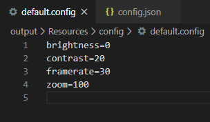

# AutoYams - Game Application

AutoYams est un projet étudiant réalisé dans le cadre des cours au [CEGEP de Sept-Îles](https://cegepsi.ca/).
Le projet consiste à automatiser le jeu de **Yams** en utilisant toute camera physique connectée à votre ordinateur pour détecter les dés présents sur votre surface de jeu.
Chacune des étapes et informations liées au projet et à son utilisation se trouveront sur la suite de ce document.

## Installation

### Utilisateur

Télécharger puis exécuter l'installateur dans l'onglet **Release**.
Les instructions propres à l'installation seront explicités au travers du déploiement.
La mise en place de l'espace de jeu se réalise en suivant les étapes dans la section **Mise en place**.

### Développeur

Afin de pouvoir développer le projet source, suivez les étapes suivantes:

1. Téléchargez [OpenCV 3.4.3](https://github.com/opencv/opencv/archive/3.4.3.zip), puis extrayez le sur votre disque dur.
2. Téléchargez [Qt5](https://www.qt.io/download-thank-you?hsLang=en), puis installer la **version 5.12.7 (64x)** pour **Microsoft Visual Studio 2015** (msvc2015_64).
3. Implicitement, télécharger [Microsoft Visual Studio 2015](https://my.visualstudio.com/Downloads?q=visual%20studio%202015&wt.mc_id=o~msft~vscom~older-downloads) puis, à partir de l'IDE, télécharger **l'extension Qt** puis redémarrer Microsoft VS 2015.
4. Dans l'IDE, précisez l'emplacement de  Qt en cliquant sur **Qt VS Tools > Qt Options** et en ajoutant le chemin de votre version (ex: *C:\Qt\5.12.7\msvc2015_64*). Idéalement, nommez la version **msvc2015-64**.
5. Clonez ou téléchargez le projet source sur votre disque dur.
6. Ouvrez la solution puis changez, dans les propriétés de la solution, la version de Qt sous **Qt Project Settings > Qt Installation** par **msvc2015-64** (pensez à être en version **x64** et en **_All Configurations_**).
7. Changez dans le **Property Manager**, à l'intérieur des fichiers **'Debug OpenCV.props'** et **'Release OpenCV.props'**, en cliquant dans l'onglet **User Macros**, le chemin d'accès du **build OpenCV** (ex: *C:\OpenCV\opencv\build*).
8. Après avoir compiler votre application en **Debug et Release**, chercher dans le dossier *build* précédent, sous **_\.\build\x64\vc14\bin_**, les fichiers **'opencv_world343.dll' (Release)** et **'opencv_world343d.dll' (Debug)** et copier-coller les aux emplacements des exécutables du projet (**_\.\Projet - TP 001\x64\\[Debug][Release]_**).

L'installation est désormais terminé mais il vous sera surement nécessaire de redémarrer **Microsoft Visual Studio 2015** et/ou **rescanner la solution** pour faire disparaître les erreurs.

## Mise en place

Afin de pouvoir mettre en place votre espace de jeu, il est important de respecter les conditions suivantes:
* La caméra lisant votre surface de jeu doit être situez au dessus de votre surface/plateau, en regardant vers le bas, avec une différence de hauteur d'entre 20 et 30 cm.
* La pièce dans laquelle vous jouez doit être suffisamment illuminée (sans être éblouie).
* Les dés que vous utilisez se doivent être blanc (ou d'une couleur très vive) et au points noirs (ou d'une couleur très sombre). Chaque dé doit avoir la même couleur.
* Le fond de votre surface de jeu ne doit pas forcément être noir mais il est important que celui ci soit unicolore et, de préférence, d'une couleur sombre et fortement démarqué des dés.
* Il est important que votre caméra soit déjà branchée avant de lancer l'application.

Durant le cours de l'application, partiellement dû à des difficultés techniques, il est important de respecter les conditions suivantes:
* La pièce dans laquelle vous jouez ne doit absolument pas être sujet à de changement de lumière, peu importe son intensité.
* À la suite d'un lancé de dés, si certains dés se trouve être collés l'un à l'autre, déplacer les légèrement chacun de leur côté.
* Si votre caméra se fait déconnecter en cours de fonctionnement, l'application risque de *freeze*/planter vous empêchant activement d’interagir avec cette dernière.

Il vous est possible, et recommander, de vérifier et configurer vos paramètres images dans l'onglet **Edit > Video** sur l'application pour vous assurez que chacun des dés apparaissent correctement. Les contours des dés devraient apparaître en **vert** et leurs points en **rouge**. Si n'importe quel autre élément que les dés apparaissent à l'image, les dés ne seront pas effectivement reconnus.

	
	
	

## Fonctionnement

Afin de pouvoir jouer localement sur une seule application (ce qui est actuellement le seul moyen de jouer), il est important de prendre les éléments suivants en compte.

### Comment jouer

Vous commencerez sur la page de **Menu** suivante:

	

Il est ici possible d'ajouter un nom sur la champ d'édition en bas du menu puis, en appuyant sur le bouton adjoint, d'ajouter le nom à la liste des joueurs si le nom a **au moins 3 caractères** et **est unique**.
Lorsque vous avez **au moins 2 joueurs**, appuyer sur **_Start Game_** pour commencer à jouer.

	

En entrant sur la page de **Jeu**, vous allez devoir configurer votre **méthode d'entrer**.
Par défaut cette dernière est mise sur **automatique**. Pour la changer, appuyer sur **Edit > Input** et sélectionner votre méthode d'entrer.
* *Manuel*: vous permet de relancer aléatoirement **tout** vos dés.
* *Semi-Automatique*: détecte automatiquement les dés mais vous demande d'accepter le dernier lancer pour détecter le prochain lancé. Pratique si votre caméra change trop fréquemment et détecte plusieurs lancés à chaque lancé physique.
* *Automatique*: Détecte et applique automatiquement les dés lancés sans validation nécessaire.

	La détection des dés se fait après **au moins une seconde** si la liste des dés est constante et de 5 entités. Si le lancé n'est pas détecté, il vous sera nécessaire de modifier les propriétés de votre configuration actuelle comme expliqué dans la section **_Configuration_**.

Les règles sont les mêmes que le jeu de Yams avec **3 lancés par joueur** chaque tour et **10 tours** avant la fin du jeu.
Pour sélectionner un coup à jouer, sélectionner l’élément après un lancé dans le **Combobox** puis appuyer sur **Accept**.
Le compteur du tour actuel, le joueur actuel ainsi que le nombre de lancer effectué est affiché en bas de la page de jeu. Chacun des dés présents sur le lancé actuel ainsi que les 3 meilleurs coups à jouer le seront aussi.
Les éléments graphiques seront automatiquement mis à jour au cours du jeu.
À la fin de la partie, une boîte de dialogue s'ouvre avec le choix de revenir sur le menu en appuyant sur **OK** ou vérifier les scores en appuyant sur **Cancel**.

### Configuration

Afin de configurer votre lecture des dés, ouvrez le fenêtre de **Configuration Vidéo** en appuyant sur **Edit > Video**. Vous serez automatiquement rediriger vers la page **Vidéo** avec la sortie d'image et de l'algorithme de détection que vous pouvez consulter en temps réel durant le jeu.

	

Vous avez, sure cette fenêtre, la possibilité de changer votre **caméra actuelle (device)** et votre **configuration**. Chaque configuration s'exprime, physiquement, sous forme d'un fichier, au format non reconnu **.config**, dans les fichiers locaux.

	

Tel qu'illustré, chaque configuration contient les 4 informations suivantes:
* *Brightness* (luminosité)
* *Contrast* (contraste)
* *Framerate* (FPS)
* *Zoom* (zoom ou échelle de l'image)

	À la fermeture de l'application ou lors du changement de configuration ou de *device*, la configuration sélectionnée sera automatiquement mise à jour.

En utilisant la page **Config** sur la même fenêtre, il vous sera possible de créer de nouvelle fenêtre (avec **add**), de relier une configuration existante à l'un de vos *device* (avec **set**) et de changer la configuration par défaut de votre *device* ainsi que le *device* par défaut de votre application avec les boutons **make** (permettant à ces derniers d'être automatiquement chargé lorsque vous démarrer votre application). Si votre *device* ne peut pas être chargée à l'ouverture, le caméra par défaut redeviendra **_'none'_**, signifiant qu'aucune caméra ne sera chargé par défaut.

	

Chacune des configurations et des *devices* ayant déjà été utilisé sur votre application seront stockées dans un fichier local: **'_config.json_'**.

	

## Problèmes

Malgré toutes les fonctionnalités actuellement présentes sur l'application, l'application présente encore quelques erreurs:
* Il n'est pas actuellement possible de sélectionner des dés à garder dans le lancer de dés en mode de sélection *Manuel*.
* La détection des dés peut être sensiblement instable et nécessite chacun des dés d'être séparé.
* En fonction de la densité des points sur la face d'un dé ainsi que la résolution de la caméra utilisée, une face de 6 points peut être lu comme 5, 4, 3 ou 2.
* Si la caméra utilisée est débranchée durant en cours de jeu, l'application plante nette.
* Dû au manque de gestion d'exception, la modification/suppression des fichiers locaux peut causer de majeur problème pour le fonctionnement de l'application.
* L'application semble être génératrice de fuite de mémoire pouvant poser problème sur le long terme si la mémoire statique n'est pas nettoyé (ce qui peut effectivement être réalisé en redémarrant votre ordinateur dans la pire des situation).

## Sources

Vous trouverez dans le projet source la **Documentation** générée avec **_Doxygen_**.
La mise en page de la documentation provient du projet suivant: [doxygen-qtify, de *fenderle*](https://github.com/fenderle/doxygen-qtify).

L'interface fut réalisée sur **Qt5.12 C++** et avec **OpenCV 3.4.3** pour le traitement d'image.
La détection des caméras connectées provient du projet suivant: [OpenCVDeviceEnumerator, de *sudiosi*](https://github.com/studiosi/OpenCVDeviceEnumerator).

Encore merci à l'équipe d'enseignement de la section **Informatique** du **CEGEP de Sept-Îles (Canada, QC)**, sans qui ce projet n'aurait été possible, ainsi qu'à **Martin CARIGNAN** pour avoir supervisé ce projet.
